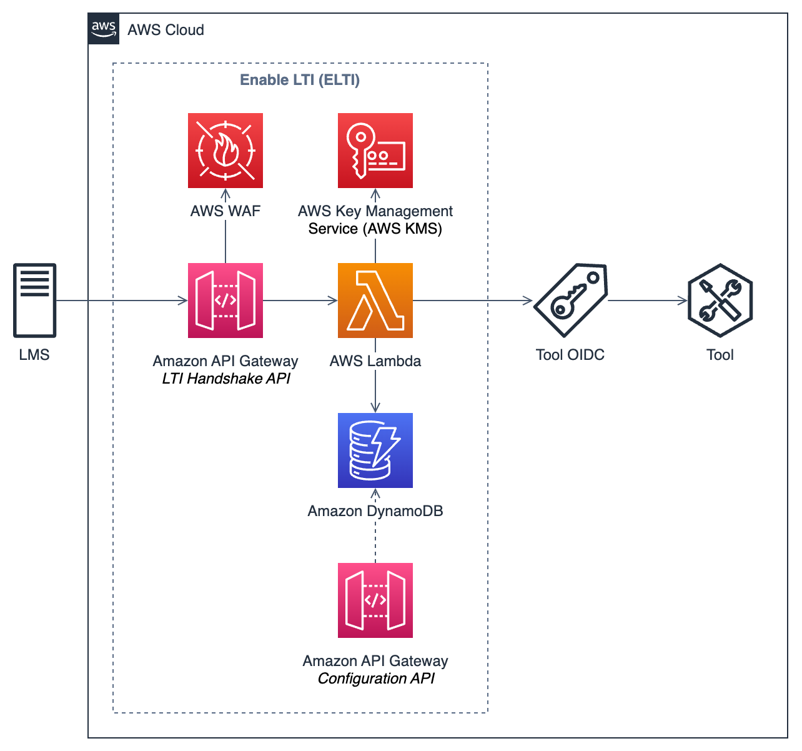
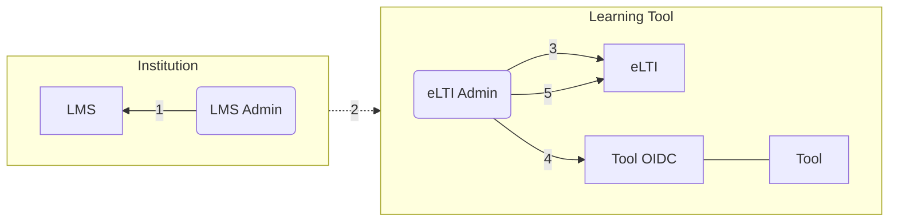
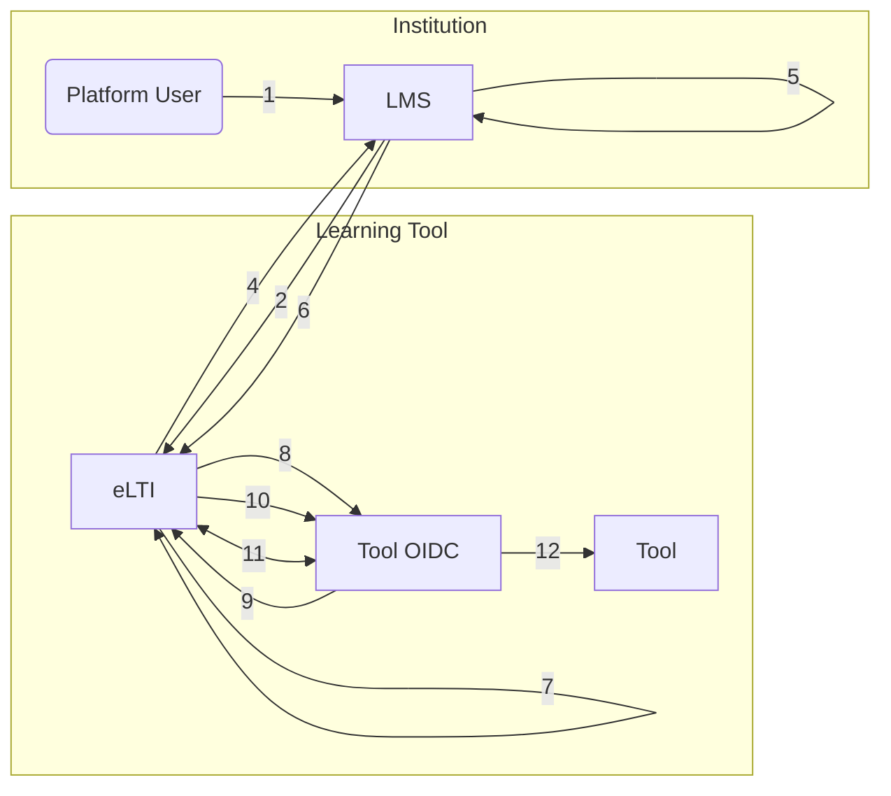
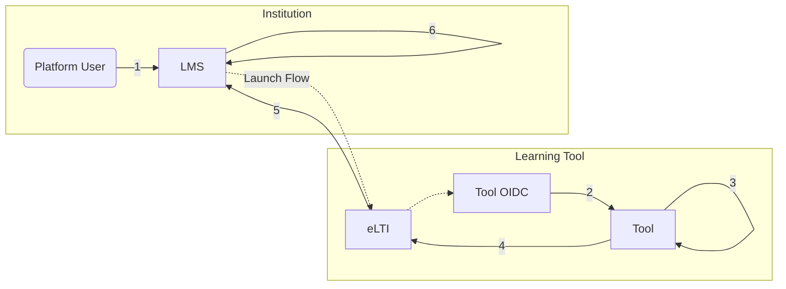
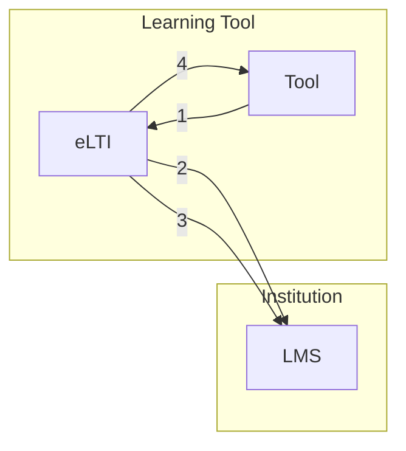

# Architecture

### AWS Service Overview

The following architecture represents an overview of the AWS services used for the implementation of eLTI.

{ width="600" }

eLTI leverages the following AWS services:

- [**AWS WAF**](https://aws.amazon.com/waf/){:target="\_blank"} is a web application firewall that helps protect web applications from attacks by allowing you to configure rules that allow, block, or monitor (count) web requests based on conditions that you define.
- [**Amazon API Gateway**](https://aws.amazon.com/api-gateway/){:target="\_blank"} is a fully managed service that makes it easy for developers to create, publish, maintain, monitor, and secure APIs at any scale. Amazon API Gateway acts as the “Front Door” for accessing our application and proxy the entire HTTP request to the AWS Lambda function. It is also used as an API to configure the tools.
- [**AWS Lambda**](https://aws.amazon.com/lambda/){:target="\_blank"} is a serverless, event-driven compute service that lets you run code for virtually any type of application or backend service without provisioning or managing servers. AWS Lambda provides the logic for the invoking the LTI handshakes and routing for the tool.
- [**Amazon DynamoDB**](https://aws.amazon.com/dynamodb/){:target="\_blank"} is a fully managed, serverless, key-value NoSQL database designed to run high-performance applications at any scale. Amazon DynamoDB is used to store persistent data such as LTI platform configuration data and user state.
- [**AWS Key Management Service (AWS KMS)**](https://aws.amazon.com/kms/){:target="\_blank"} is a managed service that helps you more easily create and control the keys used for cryptographic operations. AWS KMS is used to verify messages and generate keys for signing JSON Web Token (JWT) tokens.

## Detailed Flows

### Out-of-band registration

The following component flow diagram shows how eLTI enables a tool to be integrated into a LMS.

One time out-of-band registration steps:

1. LMS Admin configures the Learning Tool inside of the LMS using the eLTI URLs.
2. LMS Admin shares the output of the configuration with the eLTI admin. These details include the `client_id`, `secret_key`, and `deployment_id`.
3. eLTI Admin saves the platform information using eLTI's Configuration API. A platform config record is created in DynamoDB with the shared `client_id` and `deployment_id`, in addition to the platform's `iss`, `auth_token_url`, `auth_login_url`, and `access_token_url`.
4. eLTI Admin creates a new OIDC IDP in the Tool's OIDC provider with `client_id`, `secret_key`, and eLTI URLs for authorize and token endpoints.
5. eLTI Admin adds Tool and Tool OIDC information to eLTI via Configuration API. A tool config record is created in DynamoDB.

_References:_

- [LTI 1.3 Platform-Originating Messages Specification](https://www.imsglobal.org/spec/security/v1p0/#platform-originating-messages){:target="\_blank"}

### OpenID Connect launch

The following component flow diagram shows how eLTI enables a Tool to be launched by a LMS using OpenID Connect Launch flow.

The beginning of a platform initiated message contains the following OIDC launch steps:

1. A user launches LTI resource in LMS platform which is created using this tool.
2. Initiate 3rd party login request POST or GET `/login` eLTI endpoint.
3. eLTI verifies `client_id` and `iss`, then creates `state` and `nonce` uuids and stores them in DynamoDB.
4. eLTI redirects user to LMS platform’s `authorize_redirect` endpoint, registered in the _[Out-of-band registration](#out-of-band-registration)_ flow. The `redirect_url` contains the `login_hint` and `lti_message_hint` also provided in the payload from _#3_ above, in addition to the `state` and `nonce` values created.
5. LMS verifies that `redirect_url` is registered with `client_id` being sent, also confirms that `login_hint` and `lti_message_hint` are valid.
6. LMS calls the eLTI’s `/launch` endpoint, registered in the _[Out-of-band registration](#out-of-band-registration)_ flow, and gives the JWT `id_token` and `access_token` to eLTI.
7. eLTI validates `state`, `nonce`, and `id_token` before saving to DynamoDB and initializes Tool OIDC login flow.
8. eLTI redirects user to the Tool OIDC’s `/oauth2/authorize` endpoint, registered in the _[Out-of-band registration](#out-of-band-registration)_ flow. The `state` and `nonce` values that are created in _#3_ are sent included in the URL. Example of redirect URL: `https://{tool_oidc_url}/oauth2/authorize?identity_provider={lms_idp}&redirect_uri=&response_type=code&client_id=&scope=openid&state=<state>&nonce=<nonce>`
9. Tool OIDC provider will call back eLTI’s `/authProxy` endpoint, registered in the _[Out-of-band registration](#out-of-band-registration)_ flow, and sends back `state` and `nonce` values.
10. eLTI creates a new `code` value which is a uuid, associates it in DynamoDB with `state` and `nonce` created in _#3_, redirects to the `redirect_url` that from _#9_, then sends the `code` and `state` in url params and adds `nonce` as a header value.
11. Tool OIDC provider calls back eLTI’s `/tokenProxy` endpoint, registered in the _[Out-of-band registration](#out-of-band-registration)_ flow. eLTI confirms that `state`, `nonce`, and `code` are matching the values in DynamoDB and returns the token associated with as JSON response to this request.
12. Tool OIDC confirms the validity of the `id_token` and redirects user to the `redirect_url` that it got in _#8_ which is the Tool URL that user wants to load in LMS.

_References:_

- [LTI 1.3 - OpenID Connect Launch Flow Overview Specification](https://www.imsglobal.org/spec/security/v1p0/#openid_connect_launch_flow){:target="\_blank"}
- [LTI 1.3 - Authentication Response Validation](https://www.imsglobal.org/spec/security/v1p0/#authentication-response-validation){:target="\_blank"}
- [OpenID Connect - Authorization Code Flow Steps](https://openid.net/specs/openid-connect-core-1_0.html#CodeFlowSteps){:target="\_blank"}

### Deep Linking workflow

The following component flow diagram shows how eLTI enables a Tool to integrate the Deep Linking workflow.

Deep Linking workflow steps:

1. User clicks on eLTI Tool from a module, assignment, or other context which initiates an OIDC launch flow, refer to _[OpenID Connect launch](#openid-connect-launch)_ flow.
2. eLTI's Lambda function for the `/launch` endpoint checks the claim value for `lti_message_type` inside the the `id_token`. If the `lti_message_type` equals `LtiDeepLinkingRequest`, then the Deep Linking flow starts.
3. The request is then routed to the Tool at the given launch link location. The Tool then renders the requested content. The Tool can allow users to select resources to get resource links to insert into the LMS. These resource links can implement line items to specify grading and scoring. _[LTI Resource Link Specification](https://www.imsglobal.org/spec/lti-dl/v2p0#lti-resource-link){:target="\_blank"}_
4. After a user selects the resources in the Tool, the Tool submits request to eLTI with the `resource_links` and `id_token`, where eLTI signs the request to be sent to the LMS.
5. eLTI creates a deep linking response form and auto submits it to the `deep_linking_settings.deep_link_return_url` inside the `id_token` claim.
6. LMS will process the content items and render the module or assignment or other context with the selected resources.

_References:_

- [LTI 1.3 - Deep Linking Workflow](https://www.imsglobal.org/spec/lti-dl/v2p0#workflow){:target="\_blank"}

### Names and Role Provisioning Services (NRPS) workflow

The following component flow diagram shows how eLTI enables a Tool to integrate the NRPS workflow.

NRPS workflow steps:

1. Tool calls eLTI's `/rosterRetrieval` endpoint with `id_token`, `issuer`, `client_id`, `deployment_id` and `context_memberships_url`. `context_memberships_url` specifies the customer LMS's NRPS endpoint for a specific course.
2. eLTI's Lambda function for the `/rosterRetrieval` endpoint retrieves the platform configuration, which contains client ID, access token URL, and key ID (kid) for the LMS associated with the combination of `client_id`, `deployment_id`, and `issuer`. It then generates the JWT token from the platform configuration value and request access token from the LMS's access token URL.
3. Once a new access token is retrieved, it then submit `GET` request to `context_memberships_url` to retrieve the student roster from LMS.
4. When the LMS returns the response to the eLTI, eLTI forwards the response to Tool.

_References:_

- [LTI 1.3 - Name and Role Provisioning Services Specification](https://www.imsglobal.org/spec/lti-nrps/v2p0){:target="\_blank"}
