# Configuration <!-- omit in toc -->

The following steps outlined are intended to be performed after completing the [Getting Started](implementing.md#getting-started) guide. Therefore, you already have the infrastructure deployed into your AWS Account and ready to be configured.

!!! info "Info"
    The following walkthrough uses Canvas as the LMS and Amazon Cognito as the Tool OIDC IDP. The information shown below will correlate to other LMSs and Tool OIDCs.

Setup configurations included below:

- [LMS Platform Setup](#lms-platform-setup)
- [Tool OIDC IDP Setup](#tool-oidc-idp-setup)
- [eLTI Configuration](#elti-configuration)

!!! note "Note"

    The `Output: <keys>` mentioned in the following docs are specific values for your deployment. These can be found in the `packages > cdk > output.json` file if you followed the [Getting Started](implementing.md#getting-started) guide or can be viewed in the console under the Amazon CloudFormation [stack outputs](https://docs.aws.amazon.com/AWSCloudFormation/latest/UserGuide/outputs-section-structure.html). 

## LMS Platform Setup

!!! info "Info"
    Uses Canvas LMS as the example.

*Prerequisites:*

* `Tool URI` - The tool we are enabling LTI for using eLTI.
* `Output: <keys>` - From [Getting Started](implementing.md#getting-started) guide

#### Creating Developer Key <!-- omit in toc -->

1. In Canvas create a dev key by clicking on “Admin” on left
2. Select “Developer Keys“ - *URL should be simliar to [https://XXXX/accounts/X/developer_keys]*
3. Click on `+ Developer Key` button and select `LTI Key`

    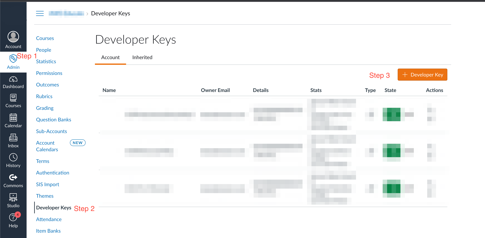

4. Make sure the Method is `Manual Entry`
5. Add a name for the key like `ExampleEnableLTIDevKey`
6. Give it a Title and Description
7. Enter the following:
    1. `Target Link URI` - Enter Tool URI
    2. `Redirect URI` - Enter `Output: apiELTIURI*`/launch
    3. `OpenID Connect Initiation URL` - Enter  `Output: apiELTIURI*`/login
8. Change JWK Method to **Public JWK URL** and enter the URL  `Output: apiELTIURI*`/jwks.json
9. In Additional Settings change Privacy Level to `Public`
10.  Under `Link Selection` → Select Message Type to be `LtiDeepLinkingRequest`

    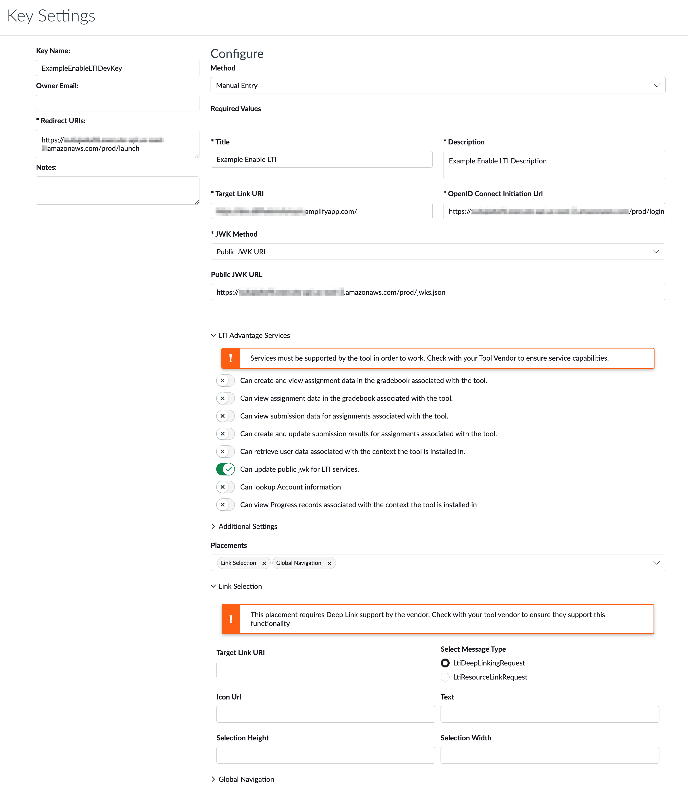

11. Click on Save button at the bottom right
12. Save the `Client Id` for later use
13. Switch the state of the Developer Key from Off to On

    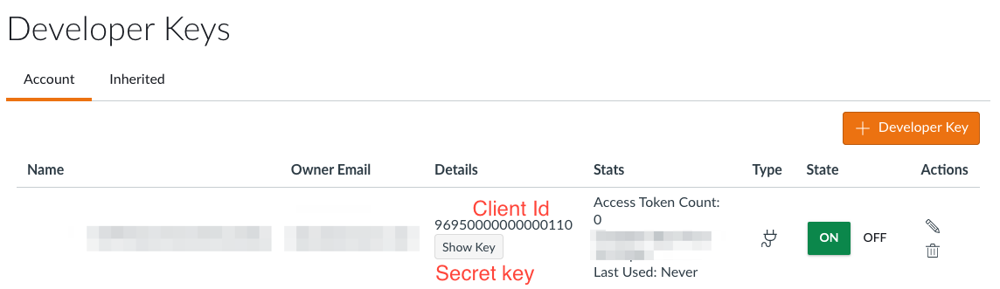

*Saved for later steps:*

* `Saved: Client Id`

#### Adding as External Tool <!-- omit in toc -->

1. After creating the developer key.
2. Go to `Admin` screen and select `Settings`, `Apps, View App Center` and click on `+App`

    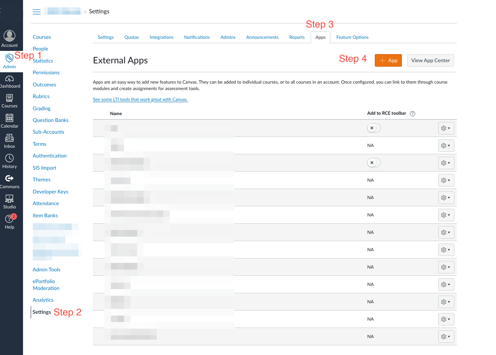

3. Change App creation config type to be **By client id.** Enter `Saved: Client Id`.

    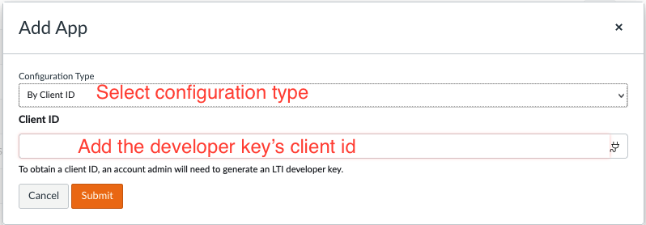

4. After adding the app, get the save the `Deployment Id` for late use.

    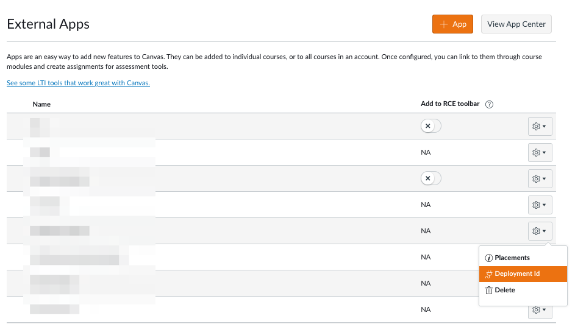

*Section Saved Outputs:*

* `Saved: Client Id`
* `Saved: Deployment Id`

## Tool OIDC IDP Setup

!!! warning "Optional"

    Only complete if you are configuring a Tool OIDC IDP.

!!! info "Info"
    Uses Canvas LMS and Amazon Cognito as the example.

*Prerequisites:*

* `Tool URI` - The tool we are enabling LTI for using eLTI.
* `Output: <keys>` - From [Getting Started](implementing.md#getting-started) guide
* `Saved: Client Id`

Add a new IDP in Cognito

1. Select the UserPool that your Tool is using.
2. Go to `Sign-in experience` → `Federated Identity Provider` and select `Add Identity Provider`

    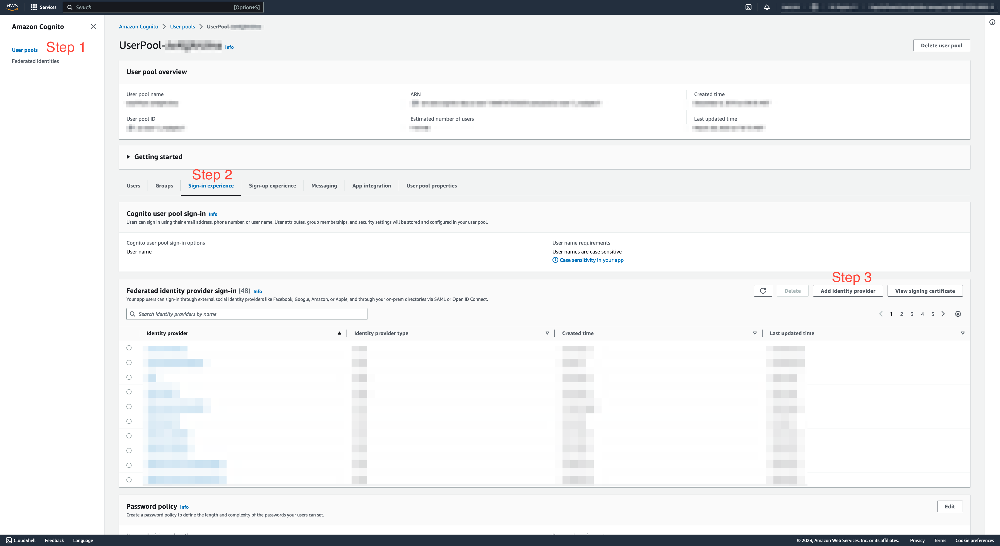

3. Add identity provider details: 
    1. Federated sign-in options: OpenId Connect (OIDC)
    2. Provider name: Enter IDP Name and save for later.
    3. Client Id: Enter `Saved: Client Id` 
    4. Authorized scopes: Default value should be “openid”
    5. Attribute request method: POST
    6. Manual input
        1. Issuer URL: *Since using Canvas in example*, Enter [https://canvas.instructure.com](https://canvas.instructure.com/)
        2. Authorization endpoint: Enter `Output: apiELTIURI*`/[authorizerProxy](https://xu6ajwkxf6.execute-api.us-east-2.amazonaws.com/prod/authorizerProxy)
        3. Token endpoint: Enter `Output: apiELTIURI*`/[tokenProxy](https://xu6ajwkxf6.execute-api.us-east-2.amazonaws.com/prod/tokenProxy)
        4. UserInfo endpoint: Enter `Output: apiELTIURI*`[/tokenProxy](https://xu6ajwkxf6.execute-api.us-east-2.amazonaws.com/prod/tokenProxy)
        5. Jwks_uri endpoint: *Since using Canvas in example*, Enter https://sso.canvaslms.com/api/lti/security/jwks

    *The Issuer and JWKS uri endpoints will be static for all platforms and be dependent on the LMS. Canvas values are provided above.

    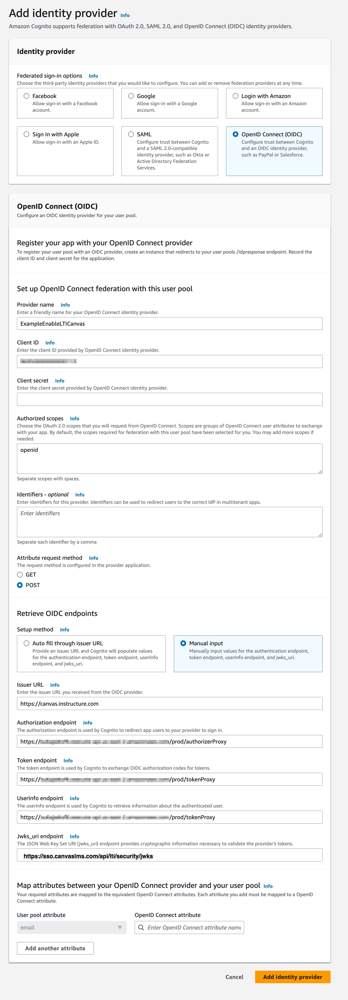

4. Add attributes. (User pool attribute → OpenID Connect attribute)
    1. custom:LMS:ClientId → azp
    2. custom:LMS:DeploymentId → https://purl.imsglobal.org/spec/lti/claim/deployment_id
    3. custom:LMS:Endpoint → https://purl.imsglobal.org/spec/lti-ags/claim/endpoint
    4. custom:LMS:Issuer→ iss
    5. custom:LMS:TargetLinkUri→ https://purl.imsglobal.org/spec/lti/claim/target_link_uri
    6. email→ email
    7. username→ sub

    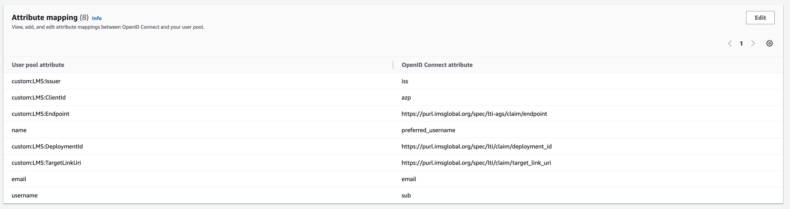

5. Add IDP to App client.
    1. Navigate to App Integration. Save the `Cognito domain` for later.
    2. Find your app client and open it. Save the `App Client ID` for later.
    3. Edit Hosted UI.
    4. Select the newly added IDP (`Saved: IDP Name`) from the Identity Providers list.
    5. Save changes. 

    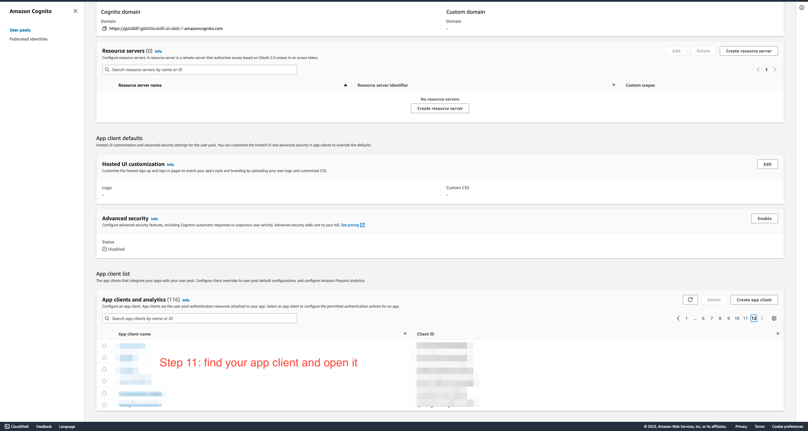

    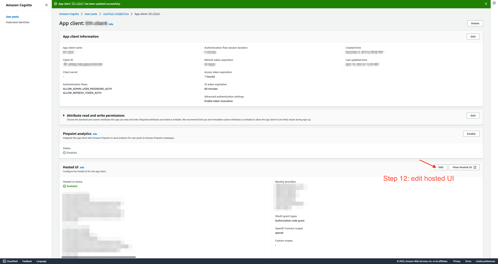

    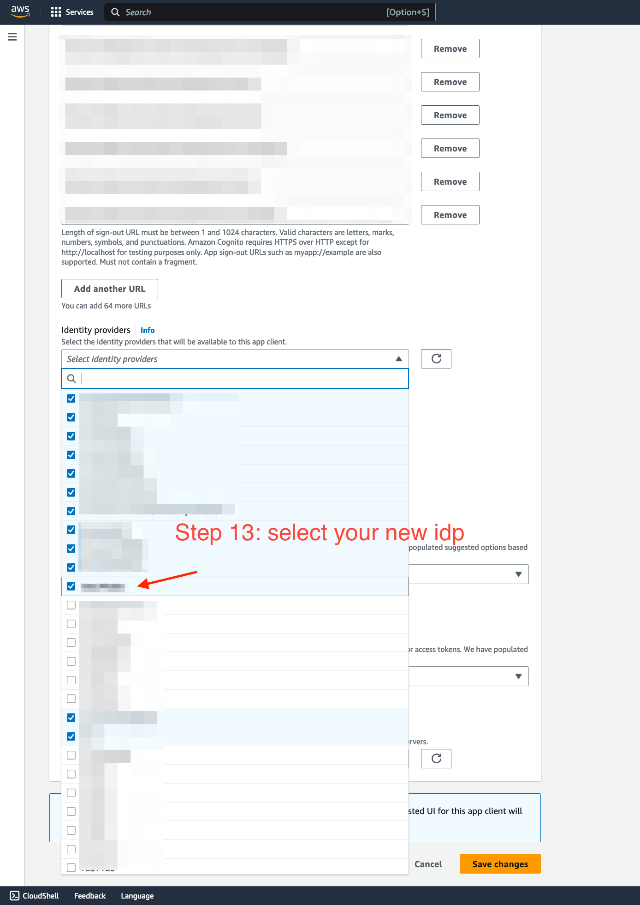

*Saved for later steps:*

* `Saved: IDP Name`
* `Saved: Cognito domain`
* `Saved: App Client Id` - Different than the LMS `Saved: Client Id` from “LMS Platform Setup”

## eLTI Configuration

Steps to configure the platform and tool inside of eLTI.

!!! info "Info"
    Uses Canvas LMS and Amazon Cognito as the example.

*Prerequisites:*

* `Tool URI` - The tool we are enabling LTI for using eLTI.
* `Output: <keys>` - From [Getting Started](implementing.md#getting-started) guide
* `Saved: Client Id`
* `Saved: Deployment Id`
* `Saved: IDP Name`
* `Saved: Cognito domain`
* `Saved: App Client Id`

The following steps [manually enter](https://docs.aws.amazon.com/amazondynamodb/latest/developerguide/getting-started-step-2.html) the data in the DynamoDB table. In addition to using the configuration API, you can see one way to automate these entries by referring to the integration test scripts in the code repository `enable-lti/test/scripts/setupInteg.ts` [here](https://github.com/aws-samples/enable-lti/blob/main/test/scripts/setupInteg.ts).

**Note:** There are two Dynamo DB tables, these objects go into the **Control Plane** table. The Control Plane table utilizes [single-table](https://aws.amazon.com/blogs/compute/creating-a-single-table-design-with-amazon-dynamodb/) design. 

Create the following entries in the `Output: tablesELTIControlPlaneTable*`

1. Create the LMS platform object.
    1. Replace with the actual saved values:
        1. `<Saved: Client Id>` with `Saved: Client Id` - **Replace both entries**
    ```
    {
        "PK": "PLATFORM#<Saved: Client Id>#https://canvas.instructure.com#",
        "accessTokenUrl": "https://sso.canvaslms.com/login/oauth2/token",
        "authLoginUrl": "https://sso.canvaslms.com/api/lti/authorize",
        "authTokenUrl": "https://sso.canvaslms.com/api/lti/authorize_redirect",
        "clientId": "<Saved: Client Id>",
        "iss": "https://canvas.instructure.com",
        "keySetUrl": "https://sso.canvaslms.com/api/lti/security/jwks"
    }
    ```

2. Create the LMS platform object with deployment id.
    1. Replace with the actual saved values.
        1. `<Saved: Client Id>` with `Saved: Client Id` - **Replace both entries**
        2. `<Saved: Deployment Id>` with `Saved: Deployment Id`
    ```
    {
        "PK": "PLATFORM#<Saved: Client Id>#https://canvas.instructure.com#<Saved: Deployment Id>",
        "accessTokenUrl": "https://sso.canvaslms.com/login/oauth2/token",
        "authLoginUrl": "https://sso.canvaslms.com/api/lti/authorize",
        "authTokenUrl": "https://sso.canvaslms.com/api/lti/authorize_redirect",
        "clientId": "<Saved: Client Id>",
        "iss": "https://canvas.instructure.com",
        "keySetUrl": "https://sso.canvaslms.com/api/lti/security/jwks"
    }
    ```

3. Create the LMS tool entry.
    1. If using Tool OIDC IDP replace with the actual saved values.
        1. `<Saved: Client Id>` with `Saved: Client Id`
        2. `<Saved: App Client Id>` with `Saved: App Client Id`
        3. `<Saved: Cognito domain>` with `Saved: Cognito domain`
        4. `<Saved: IDP Name>` with `Saved: IDP Name`
        5. `<Tool Name>` with text name of tool.
        6. `<Tool URI>` with `Tool URI`
    ```
    {
        "PK": "TOOL#<Saved: Client Id>#https://canvas.instructure.com",
        "data": {
            "LTIResourceLinks": [],
            "OIDC": {
                "clientId": "<Saved: App Client Id>",
                "domain": "<Saved: Cognito domain>/",
                "idpName": "<Saved: IDP Name>"
            }
        },
        "id": "<Tool Name>",
        "url": "<Tool URI>"
    }
    ```
    2. If NOT using a Tool OIDC replace with the actual saved values.
        1. `<Saved: Client Id>` with `Saved: Client Id`
        2. `<Tool Name>` with text name of tool.
        3. `<Tool URI>` with `Tool URI`
    ```
    {
        "PK": "TOOL#<Saved: Client Id>#https://canvas.instructure.com",
        "data": {
            "LTIResourceLinks": []
        },
        "id": "<Tool Name>",
        "url": "<Tool URI>"
    }
    ```

!!! success "Done"

    eLTI is now configured with the needed platform and tool settings. 

    Go to the LMS to test if the flow is properly configured.
