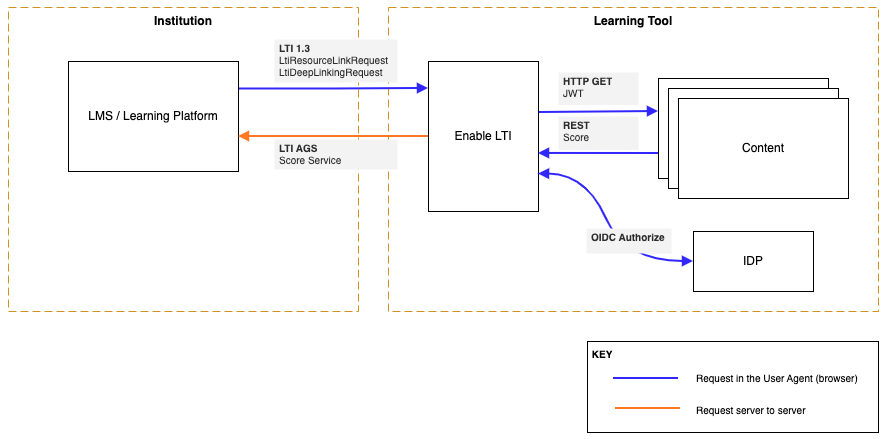

# Homepage

Enable LTI (eLTI) is a sample service to enable Learning Tool(s) to be LTI 1.3 compliant, in order to integrate with a variety of Learning Management Systems (LMS).

## Terminology

- **Enable LTI / eLTI**: This service that enables a Learning Tool to be LTI 1.3 compliant.
- **LMS / Learning Platform**: Learning Management Systems such as Blackboard, Canvas, D2L, Moodle, Open edX, etc
- **LTI**: Learning Tools Interoperability standards specification, current version is 1.3 (https://www.imsglobal.org/spec/lti/v1p3/).
- **OAuth 2.0**: Open Authorization 2.0 is an authorization framework (https://oauth.net/2/)
- **OIDC**: Open ID Connect is an authentication framework (https://openid.net/connect/)
- **Tool**: An application that provides a learning experience. This could be a content authoring tool, a content delivery tool, a gradebook, a discussion board, etc.

## Problem

Learning Management Systems implement a standard specification called LTI to interact with external tools. LTI 1.3 as a specification leverages OpenID Connect, signed JWTs, and OAuth2.0 workflows for authentication. This is a set of standards that some customers have found complex to implement.

## Purpose

This project provides a service that can be extended and/or customized to support LTI 1.3 in a Learning Tool. eLTI accepts LTI 1.3 requests from LMS, handles the validation of those requests, will lookup the destination URL to redirect the user agent (browser) to based on the LTI 1.3 request data [see LTI 1.3 Domain Model](https://www.imsglobal.org/spec/lti/v1p3/#lti-domain-model), and after authenticating the user to the Tool provided IDP, will redirect the user agent to the destination URL

The Learning Tool (content or experience) is required to support:

1. inbound federation via an OpenID Connect provider
2. the ability to issue request to RESTful APIs

## Service Usage

Instead of developing the LTI handshake mechanisms inside each Tool, this project can be used as a standalone service which will allow tools to be registered with with LMSs and be able to comply with LTI handshakes with minimal effort.

## Library Usage

Tool vendors can implement this project as part of their Tool which will allow their Tool to be registered with with LMSs and be able to comply with LTI handshakes with minimal effort.
